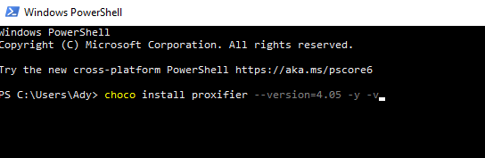
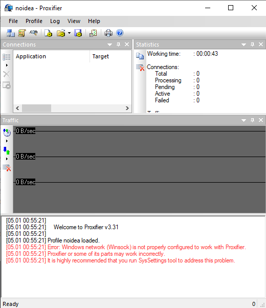
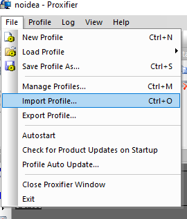
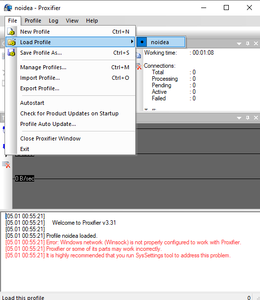
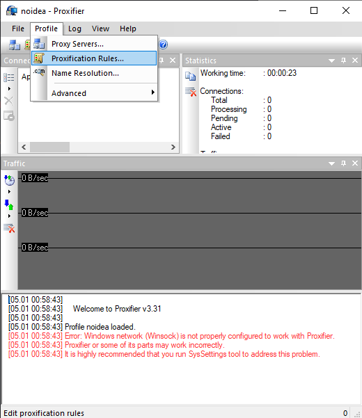
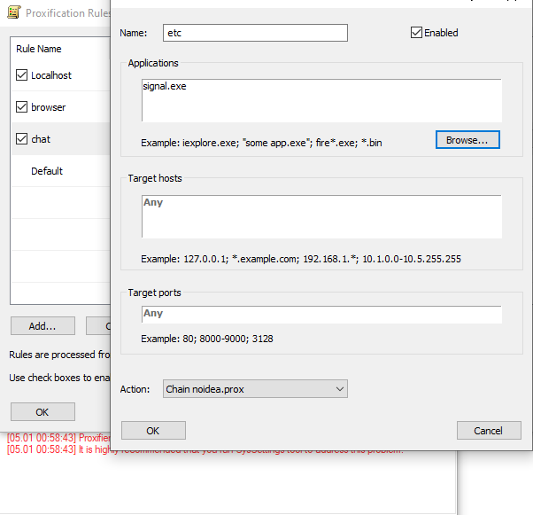
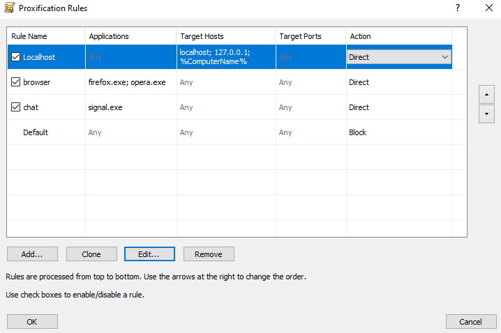

## install proxifier

* go to powershell  
* Win + x -> Windows PowerShell(Admin)

```
choco install proxifier --version=4.05 -y -v
```



## run proxifier
* Download profile: [click](https://www.dropbox.com/s/xp9b2uhkjo0ush2/noidea.ppx?dl=0)
* open proxifier



* import profile



* view profile



* done


## proxifer modified

* allowed traffic



* chose *.exe



* view status allowed/block 



* done


