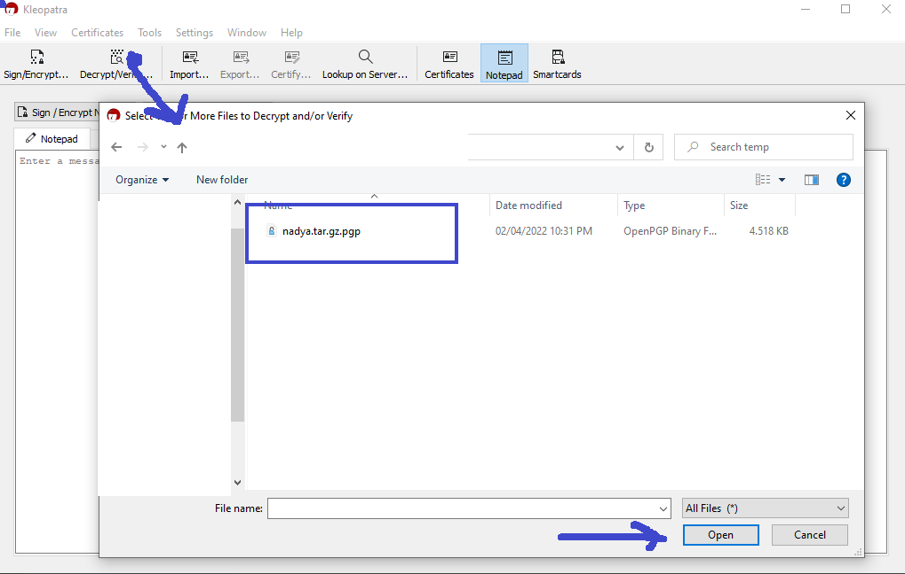
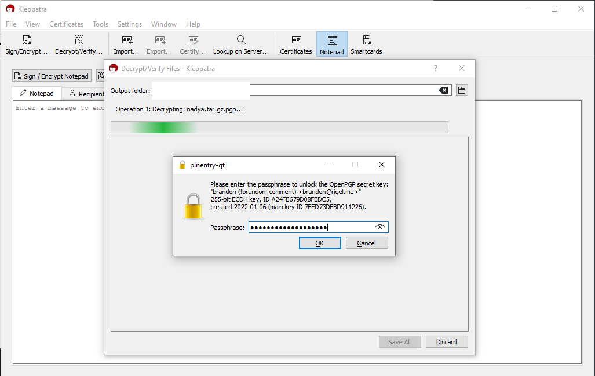
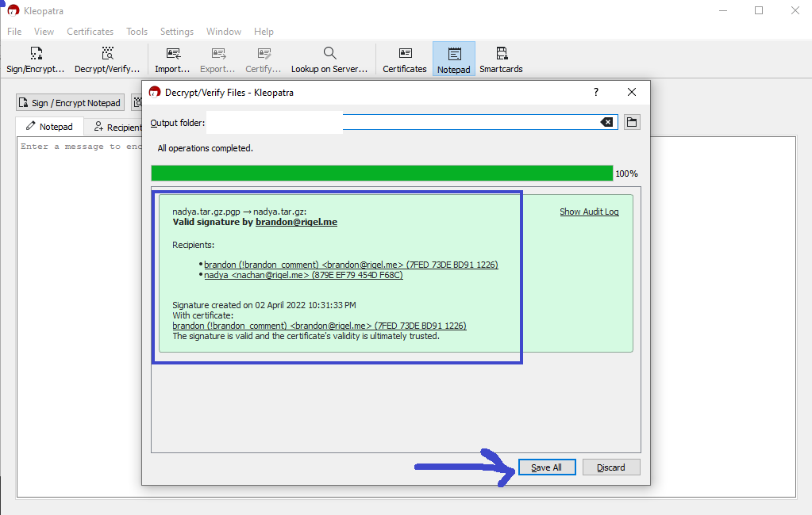

## Decrypt file using kleopatra

1. open kleopatra, select Decrypt/Verify files
   
   
2. insert phasephrase
    
   
3. success decryption save files on current directory
 
   
4. open files

   